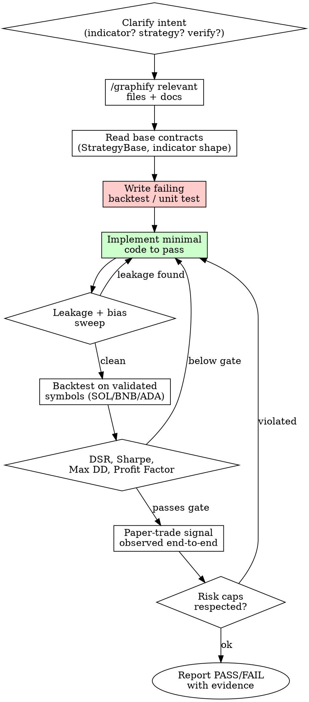

# Trading Strategy Dev

Author and verify trading indicators, strategies, and the trading-engine wiring with discipline. No HTTP-200 victories. No look-ahead. No silent risk-cap relaxation.

## Core principles (load-bearing)

1. **No look-ahead leakage.** Indicators consume only data up to and including bar `t`. Signals at bar `t` decide actions filled at bar `t+1` open (or current bar close in event-driven). Validate with the leakage test in `references/leakage-tests.md`.
2. **Risk caps are non-negotiable.** Per `CLAUDE.md`: 10% capital/trade max in paper (ADR-010; $1,000 on the $10,000 account per ADR-029), 12% daily-loss circuit-breaker (ADR-028), LIVE per-trade cap 2% ($200) untouched. Position sizing in any new strategy MUST honour these via `StrategyBase.calculate_position_size`. Do not bypass, and never hardcode the account size — route through declared config.
3. **Returns target, not direction.** Directional-accuracy metrics carry look-ahead leakage history in this repo (V0 GRU rebuild). Score on log-returns, evaluate against naive persistence, and gate via Deflated Sharpe Ratio (DSR > 0.95) before claiming alpha.
4. **No production code without a failing backtest first.** New strategy / new param set: write the test (or backtest harness invocation) that *would* reject the current implementation, watch it fail, then implement.
5. **Evidence > assertions.** Pass/fail of any change must produce: backtest metrics on validated symbols (SOL/BNB/ADA primary, BTC/ETH after re-add), per-symbol equity curve, and at minimum one paper-trade signal observed end-to-end.

## When to use

- User asks to write or modify an indicator (anything in `services/technical-analysis/app/indicators/`).
- User asks to write or modify a strategy (`services/trading-engine/app/strategies/` or `backtesting/strategies/`).
- User asks to verify existing strategies are still working / not broken by recent changes.
- User asks to audit the trading-engine pipeline (signal → risk → execution → fills).
- Trigger phrases: "write/add/build indicator", "write/add strategy", "verify strategies", "audit engine", "check trading engine", "/strategy-dev".

## When NOT to use

- General Python questions (use normal flow).
- Pure UI work in frontend (use frontend-design skill).
- Just running a backtest (use `/backtest` skill directly).
- DB / infra changes (use deploy / start-system skills).

## Workflow



### 1. Clarify intent

Ask once if ambiguous: indicator (transforms OHLCV into a series), strategy (consumes indicators + emits signals), or verification (existing code, no new logic). Different files, different gates. Don't guess.

### 2. /graphify before searching

Per `CLAUDE.md` mandatory rule. Build the graph over: requested files, `services/trading-engine/app/strategies/base.py`, `services/technical-analysis/app/indicators/__init__.py`, recent ADRs in `wiki/decisions/`. Read audit. Then targeted search via serena / grep / context7.

### 3. Honour the contracts

**Indicator contract** (`services/technical-analysis/app/indicators/<name>.py`):
- Input: `pd.DataFrame` with columns `open, high, low, close, volume`, monotonic UTC timestamp index.
- Output: typed result (Series / dict / dataclass) — no in-place mutation of input.
- Module-level docstring documents period defaults, optimization date, rationale (mirror `rsi.py` style).
- No network / DB calls. Pure function on a frame.
- Crypto-tuned defaults (RSI: period=9, OB=80, OS=20). Document any deviation.

**Strategy contract** (`services/trading-engine/app/strategies/<name>.py`):
- Inherit `StrategyBase` from `app/strategies/base.py`.
- Implement `analyze(symbol, data) -> AnalysisResult`, `generate_signals(symbol, analysis, current_price) -> List[StrategySignal]`, `calculate_position_size(signal, capital, risk_pct) -> Decimal`.
- `StrategyMetadata` with `risk_level`, `category`, `min_capital`, `compatible_market_conditions`.
- `calculate_position_size` MUST clamp at the configured per-trade cap — 10% of capital in paper (ADR-010/ADR-029: $1,000 on the $10,000 account), 2% in LIVE ($200). If the signal demands more, downscale and log; do not break the cap. Capital comes from declared config (`shared/account.py` host-side, service `Settings` in-container), never a literal.
- Stop-loss derivation goes through `atr_stops.py` or an equivalent ATR-based helper — no fixed-percentage stops.
- SHORT signals respect Jan 2026 commit `380a674` enforcement; do not regress.

### 4. Test-first, then implement

For an indicator:
- Add a unit test under `services/technical-analysis/tests/indicators/test_<name>.py` that asserts the calculated value against a hand-computed example for a known fixture frame.
- Add the leakage test in `references/leakage-tests.md` — recompute on a truncated window, assert prefix equality.

For a strategy:
- Add a backtest invocation: `python3 backtesting/run_phase1_backtest.py --symbol SOLUSDT --days 60 --strategy <name>` (extend the runner if it doesn't accept `--strategy`).
- Define an explicit acceptance gate before running (e.g. "Sharpe > 0.8 on SOL+BNB+ADA blended; max DD < 25%; profit factor > 1.2"). Without a gate, "passes" is meaningless.

Watch the test fail with the placeholder implementation. Then implement minimal logic to pass.

### 5. Leakage + survivorship sweep

Run `references/leakage-tests.md` checks every time. The crypto-trading-bot already has one famous look-ahead leakage incident (V0 GRU directional accuracy). Treat this as a default suspicion, not an edge case.

### 6. Backtest with the right data window

- Validated symbols only: `SOLUSDT, BNBUSDT, ADAUSDT` always; `BTCUSDT, ETHUSDT` re-added 2026-05-03.
- Avoid pre-2026-04-25 candles in TimescaleDB (testnet pollution). Either restrict `--days` to dates after the flip, or refresh klines from Bybit mainnet via `data_downloader.py` first.
- Run the `/backtest` skill end-to-end — do not eyeball curves. Read the printed metrics table.

### 7. Acceptance gate

A change ships only when ALL hold:
- DSR > 0.95 vs naive persistence (for ML / signal-quality changes), OR Sharpe > 0.8 + DD < 25% + PF > 1.2 on validated symbols (for rule-based strategies).
- No risk-cap violation in the simulated trade log.
- One end-to-end paper-trade observed with the new code path active in `trading-engine` (signal seen in DB `signals` row, order seen in `orders` row, notification delivered).
- Service was restarted after config change (per `CLAUDE.md` "stale in-memory state" gotcha).

If a gate fails, report which one and stop. Do not re-run hoping for a different number — that's p-hacking.

## Verifying existing strategies (audit mode)

Use this branch when the user says "verify the old strategies are working" or "check the engine". No new code, just evidence.

Runbook:

1. **List active strategies the engine can dispatch.**
   ```bash
   grep -rn "register_strategy\|StrategyCategory" services/trading-engine/app/strategies/ | head -40
   ```
2. **Check coordinator wiring.** Read `services/trading-engine/app/strategies/coordinator.py` and `aggregator.py` — confirm each strategy imported is reachable (no orphaned files like `mean_reversion.py` AND `mean_reversion_strategy.py` both being live).
3. **Run the unit test sweep:** `pytest services/trading-engine/tests/ services/technical-analysis/tests/ -x --tb=short`.
4. **Run a 30-day backtest per validated symbol.** Use the `/backtest` skill. Capture per-symbol metrics into a small markdown table.
5. **Sanity-check live engine.** With `docker compose -f docker-compose.unified.yml up -d` running:
   - `curl -sf http://localhost:8005/health && curl -sf http://localhost:8005/ready`
   - Tail `docker compose ... logs -f trading-engine` for ~5 min in paper mode and confirm: signals being generated, risk_manager rejecting positions over cap, auto_trader loop ticking (if `EMERGENCY_STOP` absent and `AUTO_TRADING_ENABLED=true`).
   - Query DB: `SELECT id, symbol, strategy, signal_type, confidence, created_at FROM signals ORDER BY created_at DESC LIMIT 20;` — confirm fresh rows with sane confidences.
6. **Verify risk caps actually bind.** Read `risk_manager.py`. Look for the per-trade clamp (`max_risk_per_trade = 0.10` fraction in paper, `0.02` LIVE) and the 12% daily-loss kill-switch (`max_daily_loss_pct = 12.0` per ADR-028 — a *percent*, not a fraction; unit mismatch here has shipped a never-firing check before). Grep for any literal `0.02`, `0.10`, `12.0`, or env override; confirm not silently overridden.
7. **Report.** One PASS/FAIL line per check. No aggregation. Anything other than PASS surfaces verbatim with the failing evidence.

## Auditing the trading engine wiring

When the user says "check the work of the trading engine" — that's about whether the pipeline (signal → risk → sizer → execution → fills → DB → notification) is intact, not about strategy alpha.

Use the diagram in `references/engine-pipeline.md` as the checklist. Walk it edge by edge, citing file:line for each junction. Anything missing or stale gets reported, not patched silently.

## Anti-patterns (auto-fail)

- Adding a new strategy file but not registering it in the coordinator / aggregator — dead code.
- Reading future bars in an indicator (e.g. centred moving averages without clipping) — leakage.
- Hard-coding stop-loss as fixed pct of price — bypasses ATR. Reject.
- Bypassing `calculate_position_size` to ship "just one trade at 5% size for the test" — caps are project-load-bearing.
- Writing a backtest that uses validation-set parameters tuned on the same window — overfit. Walk-forward only.
- Declaring a strategy "working" because the unit tests pass — strategies are alpha-claims, not type-checks. Backtest + paper-trade evidence required.
- Using directional accuracy as the headline metric — repeat of the V0 GRU mistake.

## Files in this skill

- `SKILL.md` (this file) - workflow + contracts.
- `references/leakage-tests.md` - copy-paste tests to detect look-ahead and survivorship bias.
- `references/engine-pipeline.md` - signal-to-fill pipeline map with file:line anchors and verification commands.
- `references/strategy-template.py` - minimal `StrategyBase` skeleton honoring contract.
- `references/indicator-template.py` - minimal indicator module honoring contract.
- `references/acceptance-gates.md` - the canonical gate values and how to compute DSR.
