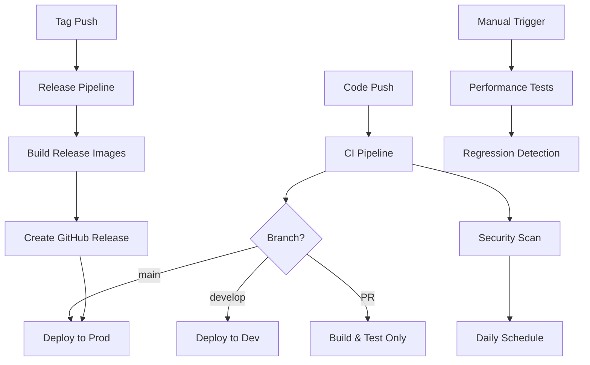

# GitHub Actions CI/CD Workflows

Complete CI/CD pipeline documentation for the Crypto Trading Bot microservices platform.

## Table of Contents

- [Overview](#overview)
- [Workflows](#workflows)
- [Required Secrets](#required-secrets)
- [Workflow Triggers](#workflow-triggers)
- [Usage Examples](#usage-examples)
- [Troubleshooting](#troubleshooting)
- [Best Practices](#best-practices)

## Overview

This repository uses GitHub Actions for continuous integration and deployment. The CI/CD pipeline includes:

- **Automated Testing**: Unit, integration, and end-to-end tests
- **Code Quality**: Linting, type checking, and security scanning
- **Docker Builds**: Multi-stage builds with caching
- **Security Scanning**: Dependency, container, and SAST scanning
- **Automated Deployments**: Dev, staging, and production environments
- **Performance Testing**: Load testing and regression detection
- **Release Management**: Automated releases with changelogs

### Workflow Architecture



## Workflows

### 1. CI - Continuous Integration (`ci.yml`)

**Purpose**: Validate code quality, run tests, and build Docker images

**Triggers**:
- Push to any branch
- Pull requests to `main` or `develop`

**Jobs**:
1. **Code Quality** (~5 min)
   - Black (formatting)
   - isort (import sorting)
   - Flake8 (linting)
   - Mypy (type checking)
   - Bandit (security)
   - Safety (dependency vulnerabilities)
   - Pylint (advanced linting)

2. **Test Services** (~10 min, parallel matrix)
   - Run pytest for all 10 services
   - Coverage reporting (80% minimum)
   - Upload to Codecov
   - PostgreSQL and Redis service containers

3. **Build Docker Images** (~15 min, parallel matrix)
   - Build all 10 service images
   - Trivy security scanning
   - Docker layer caching
   - Upload SARIF to GitHub Security

4. **Integration Tests** (~10 min)
   - Docker Compose deployment
   - Cross-service testing
   - Health check validation

**Total Duration**: ~15 minutes (with parallelization)

**Example Run**:
```bash
# Triggered automatically on push
git push origin feature/new-trading-strategy

# View results
gh run list --workflow=ci.yml
gh run view --log
```

### 2. CD - Deploy to Development (`cd-dev.yml`)

**Purpose**: Automated deployment to development Kubernetes cluster

**Triggers**:
- Push to `develop` branch
- Manual workflow dispatch

**Jobs**:
1. **Build and Push** (~10 min)
   - Build Docker images with `dev-` tags
   - Push to GitHub Container Registry
   - Multi-arch support (amd64, arm64)

2. **Deploy to Dev** (~8 min)
   - Apply Kubernetes manifests
   - Rolling update strategy
   - Wait for rollout completion
   - Apply HPA and Ingress

3. **Smoke Tests** (~5 min)
   - Health endpoint checks
   - Basic API validation
   - Service connectivity tests

4. **Notification** (~1 min)
   - Slack notification with status
   - Deployment summary

**Total Duration**: ~15 minutes

**Environment URL**: https://dev.crypto-bot.internal

**Example Run**:
```bash
# Automatic on push to develop
git push origin develop

# Manual trigger
gh workflow run cd-dev.yml
```

### 3. CD - Deploy to Production (`cd-prod.yml`)

**Purpose**: Safe production deployment with blue-green strategy

**Triggers**:
- Push to `main` branch (requires approval)
- Manual workflow dispatch

**Jobs**:
1. **Pre-deployment Checks** (~3 min)
   - Verify CI passed
   - Check for breaking changes
   - Validate version tags

2. **Build and Push** (~12 min)
   - Production-grade images
   - Semantic versioning tags
   - Image signing (Cosign)
   - SBOM generation (Syft)

3. **Deploy to Production** (~15 min)
   - Blue-green deployment
   - Health checks on green
   - Traffic switch
   - Automated rollback on failure

4. **Post-deployment Tests** (~10 min)
   - Smoke tests
   - End-to-end tests
   - Performance baseline check

5. **Create GitHub Release** (~2 min)
   - Generate changelog
   - Create release notes
   - Tag version

**Total Duration**: ~25 minutes

**Environment URL**: https://crypto-bot.example.com

**Manual Approval**: Required for production

**Example Run**:
```bash
# Merge to main triggers workflow (requires approval)
git push origin main

# Manual trigger with approval
gh workflow run cd-prod.yml
```

### 4. Security Scanning (`security-scan.yml`)

**Purpose**: Comprehensive security vulnerability scanning

**Triggers**:
- Daily at 2 AM UTC
- Push to `main` or `develop`
- Pull requests
- Manual workflow dispatch

**Jobs**:
1. **Dependency Scan** (~10 min)
   - Safety (Python vulnerabilities)
   - pip-audit (dependency audit)
   - Fail on critical vulnerabilities

2. **Docker Image Scan** (~20 min, parallel)
   - Trivy vulnerability scanner
   - Grype alternative scanner
   - SARIF upload to GitHub Security

3. **SAST Scan** (~15 min)
   - Bandit (Python security)
   - Semgrep (pattern matching)
   - Security hotspot detection

4. **Secret Scanning** (~8 min)
   - TruffleHog (secret detection)
   - Gitleaks (credential scanning)
   - Git history analysis

5. **IaC Scan** (~12 min)
   - Checkov (Terraform/K8s)
   - KICS (Kubernetes security)
   - Policy enforcement

6. **License Compliance** (~8 min)
   - pip-licenses checker
   - License compatibility
   - Forbidden license detection

**Total Duration**: ~20 minutes (with parallelization)

**Example Run**:
```bash
# Manual security scan
gh workflow run security-scan.yml

# View security alerts
gh api repos/{owner}/{repo}/code-scanning/alerts
```

### 5. Performance Testing (`performance-test.yml`)

**Purpose**: Load testing and performance regression detection

**Triggers**:
- Weekly on Sunday at 3 AM UTC
- Manual workflow dispatch
- Pull requests with `perf-test` label

**Jobs**:
1. **Setup Perf Environment** (~10 min)
   - Deploy to test namespace
   - Initialize databases
   - Warm up services

2. **K6 Load Testing** (~20 min)
   - Ramp-up load pattern
   - API endpoint testing
   - Latency thresholds
   - Error rate validation

3. **Locust Load Testing** (~20 min)
   - User behavior simulation
   - WebSocket testing
   - Concurrent user load

4. **Database Performance** (~15 min)
   - Query benchmarking
   - Insert/update performance
   - Connection pooling tests

5. **API Latency Profiling** (~10 min)
   - Hey load generator
   - Response time percentiles
   - Throughput measurement

6. **Regression Detection** (~5 min)
   - Compare with baseline
   - Detect performance degradation
   - Alert on regressions

**Total Duration**: ~45 minutes

**Example Run**:
```bash
# Manual performance test
gh workflow run performance-test.yml \
  --field duration=10 \
  --field users=100 \
  --field target_env=staging
```

### 6. Build Service (Reusable) (`build-service.yml`)

**Purpose**: Reusable workflow for building individual services

**Usage**: Called from other workflows

**Inputs**:
- `service_name`: Service to build
- `dockerfile_path`: Path to Dockerfile
- `image_tag`: Docker image tag
- `push_to_registry`: Whether to push
- `run_security_scan`: Enable security scan

**Outputs**:
- `image_digest`: SHA256 digest
- `image_full_name`: Full image name
- `security_scan_passed`: Scan result

**Example Usage**:
```yaml
jobs:
  build-api-gateway:
    uses: ./.github/workflows/build-service.yml
    with:
      service_name: api-gateway
      dockerfile_path: services/api-gateway
      image_tag: v1.0.0
      push_to_registry: true
    secrets:
      registry_username: ${{ secrets.DOCKER_USERNAME }}
      registry_password: ${{ secrets.DOCKER_PASSWORD }}
```

### 7. Deploy to Kubernetes (Reusable) (`deploy-k8s.yml`)

**Purpose**: Reusable workflow for Kubernetes deployments

**Usage**: Called from CD workflows

**Inputs**:
- `environment`: dev/staging/prod
- `namespace`: Kubernetes namespace
- `image_tags`: JSON map of services to images
- `deployment_strategy`: rolling/blue-green/canary
- `run_smoke_tests`: Enable smoke tests
- `rollback_on_failure`: Auto-rollback

**Outputs**:
- `deployment_status`: success/failed
- `deployed_version`: Deployed version

**Example Usage**:
```yaml
jobs:
  deploy:
    uses: ./.github/workflows/deploy-k8s.yml
    with:
      environment: production
      namespace: crypto-bot-prod
      image_tags: '{"api-gateway": "ghcr.io/org/api-gateway:v1.0.0"}'
      deployment_strategy: blue-green
      run_smoke_tests: true
      rollback_on_failure: true
    secrets:
      kube_config: ${{ secrets.KUBE_CONFIG_PROD }}
```

### 8. Release (`release.yml`)

**Purpose**: Automated release creation and deployment

**Triggers**:
- Tag push matching `v*.*.*`
- Manual workflow dispatch

**Jobs**:
1. **Validate Release** (~3 min)
   - Version format validation
   - Pre-release detection
   - CI status verification

2. **Generate Changelog** (~5 min)
   - Categorized commits
   - Update CHANGELOG.md
   - Feature/bug/improvement sections

3. **Build Release Images** (~12 min)
   - Semantic versioning
   - Multiple tags (v1.0.0, 1.0.0, latest)
   - Image labels and metadata

4. **Create GitHub Release** (~2 min)
   - Release notes
   - Docker image links
   - Installation instructions

5. **Deploy to Production** (~25 min)
   - Call deploy-k8s workflow
   - Blue-green strategy
   - Production validation

6. **Post-release Tasks** (~3 min)
   - Create release branch
   - Team notification
   - Documentation update

**Total Duration**: ~30 minutes

**Example Run**:
```bash
# Create and push tag
git tag -a v1.0.0 -m "Release v1.0.0"
git push origin v1.0.0

# Manual release
gh workflow run release.yml --field version=v1.0.1
```

## Required Secrets

Configure these secrets in GitHub repository settings:

### Container Registry
```bash
DOCKER_REGISTRY_URL          # ghcr.io
DOCKER_REGISTRY_USERNAME     # GitHub username
DOCKER_REGISTRY_PASSWORD     # GitHub token
```

### Kubernetes Clusters
```bash
KUBE_CONFIG_DEV              # Base64 encoded kubeconfig for dev
KUBE_CONFIG_STAGING          # Base64 encoded kubeconfig for staging
KUBE_CONFIG_PROD             # Base64 encoded kubeconfig for prod
```

To encode kubeconfig:
```bash
cat ~/.kube/config | base64 -w 0
```

### API Credentials
```bash
BYBIT_API_KEY_DEV            # Bybit testnet API key
BYBIT_API_SECRET_DEV         # Bybit testnet API secret
BYBIT_API_KEY_PROD           # Bybit production API key
BYBIT_API_SECRET_PROD        # Bybit production API secret
```

### Database Passwords
```bash
DATABASE_PASSWORD_DEV        # PostgreSQL dev password
DATABASE_PASSWORD_STAGING    # PostgreSQL staging password
DATABASE_PASSWORD_PROD       # PostgreSQL prod password
REDIS_PASSWORD_PROD          # Redis prod password
RABBITMQ_PASSWORD_PROD       # RabbitMQ prod password
```

### External Services
```bash
CODECOV_TOKEN                # Codecov.io token
SLACK_WEBHOOK_URL            # Slack notification webhook
GITLEAKS_LICENSE             # Gitleaks license (optional)
```

### Production API Secrets (JSON format)
```bash
PROD_API_SECRETS             # JSON string of all prod secrets
```

Example:
```json
{
  "bybit-api-key": "xxx",
  "bybit-api-secret": "yyy",
  "database-password": "zzz",
  "redis-password": "aaa",
  "rabbitmq-password": "bbb"
}
```

## Workflow Triggers

### Automatic Triggers

| Event | Workflows |
|-------|-----------|
| Push to any branch | CI |
| Push to `develop` | CI, CD-Dev |
| Push to `main` | CI, CD-Prod (with approval) |
| Pull Request | CI, Security Scan |
| Tag `v*.*.*` | Release |
| Daily 2 AM UTC | Security Scan |
| Weekly Sunday 3 AM UTC | Performance Test |

### Manual Triggers

All workflows support manual triggering:

```bash
# List available workflows
gh workflow list

# Trigger specific workflow
gh workflow run ci.yml
gh workflow run cd-dev.yml
gh workflow run security-scan.yml
gh workflow run performance-test.yml
gh workflow run release.yml --field version=v1.0.0
```

## Usage Examples

### Deploy Feature to Development

```bash
# Create feature branch
git checkout -b feature/new-indicator
# Make changes
git commit -m "feat: add RSI indicator"
git push origin feature/new-indicator

# Merge to develop (triggers dev deployment)
git checkout develop
git merge feature/new-indicator
git push origin develop
```

### Create Production Release

```bash
# Ensure main is up to date
git checkout main
git pull origin main

# Create release tag
git tag -a v1.2.0 -m "Release v1.2.0 - Add RSI indicator"
git push origin v1.2.0

# Workflow automatically:
# 1. Builds release images
# 2. Creates GitHub release
# 3. Deploys to production (with approval)
```

### Run Security Scan

```bash
# Manual security scan
gh workflow run security-scan.yml

# Wait for completion
gh run watch

# View results
gh run view --log
```

### Performance Testing

```bash
# Run performance tests against staging
gh workflow run performance-test.yml \
  --field duration=15 \
  --field users=200 \
  --field target_env=staging

# Download performance reports
gh run download <run-id>
```

### Rollback Production Deployment

```bash
# Find previous successful deployment
gh run list --workflow=cd-prod.yml --status=success

# Get previous image tags
gh run view <run-id>

# Create rollback PR with previous image tags
# Or manually trigger deployment with previous version
gh workflow run cd-prod.yml --field version=v1.1.0
```

## Troubleshooting

### CI Failures

**Problem**: Tests failing intermittently

**Solution**:
```bash
# Check test logs
gh run view <run-id> --log

# Re-run failed jobs
gh run rerun <run-id> --failed

# Run tests locally
pytest services/api-gateway/tests/ -v
```

**Problem**: Coverage below 80%

**Solution**:
```bash
# Generate local coverage report
pytest --cov=services/api-gateway --cov-report=html

# Open htmlcov/index.html to see missing lines
# Add tests for uncovered code
```

### Deployment Failures

**Problem**: Deployment stuck in rollout

**Solution**:
```bash
# Check pod status
kubectl get pods -n crypto-bot-dev

# View pod logs
kubectl logs -n crypto-bot-dev deployment/api-gateway

# Describe pod for events
kubectl describe pod -n crypto-bot-dev <pod-name>

# Manual rollback
kubectl rollout undo deployment/api-gateway -n crypto-bot-dev
```

**Problem**: Health checks failing

**Solution**:
```bash
# Port-forward to test locally
kubectl port-forward -n crypto-bot-dev svc/api-gateway 8000:8000

# Test health endpoint
curl http://localhost:8000/health

# Check service configuration
kubectl get svc api-gateway -n crypto-bot-dev -o yaml
```

### Security Scan Issues

**Problem**: High vulnerabilities in dependencies

**Solution**:
```bash
# Update dependencies
pip install --upgrade <package>
pip freeze > requirements.txt

# Check for compatible versions
pip install safety
safety check -r requirements.txt

# Update Dockerfile base image
# FROM python:3.12-slim-bookworm
```

**Problem**: Secrets detected in code

**Solution**:
```bash
# Use environment variables instead
# BAD: api_key = "sk_live_xxx"
# GOOD: api_key = os.getenv("API_KEY")

# Remove from git history
git filter-branch --force --index-filter \
  "git rm --cached --ignore-unmatch path/to/file" \
  --prune-empty --tag-name-filter cat -- --all

# Force push (careful!)
git push origin --force --all
```

### Performance Test Issues

**Problem**: Performance degradation detected

**Solution**:
```bash
# Compare with baseline
gh run download <baseline-run-id>
gh run download <current-run-id>

# Analyze k6 results
cat k6-summary.json | jq '.metrics.http_req_duration'

# Profile slow endpoints
kubectl exec -it deployment/api-gateway -- python -m cProfile app/main.py

# Check resource usage
kubectl top pods -n crypto-bot-dev
```

## Best Practices

### 1. Branch Strategy

```
main          ─────●─────●─────●───── (production)
               ╱    ╲     ╱     ╲
develop   ─────●──────●──────●─────── (staging/dev)
           ╱    ╲
feature  ─●──────●                    (feature branches)
```

- `main`: Production-ready code
- `develop`: Integration branch
- `feature/*`: Feature development
- `hotfix/*`: Production hotfixes
- `release/*`: Release preparation

### 2. Commit Messages

Follow [Conventional Commits](https://www.conventionalcommits.org/):

```bash
feat: add new trading strategy
fix: resolve order execution bug
docs: update API documentation
test: add integration tests for portfolio
refactor: optimize database queries
perf: improve indicator calculation speed
chore: update dependencies
```

### 3. Pull Requests

- Always create PR for changes
- Wait for CI to pass
- Require code review approval
- Use `perf-test` label for performance-critical changes
- Squash commits before merging

### 4. Testing

- Write tests before implementation (TDD)
- Maintain 80%+ coverage
- Use markers for test categorization:
  ```python
  @pytest.mark.unit
  @pytest.mark.integration
  @pytest.mark.slow
  ```
- Run full test suite before merging to `main`

### 5. Security

- Never commit secrets
- Use environment variables
- Rotate credentials regularly
- Review security scan results
- Update dependencies weekly

### 6. Deployments

- Deploy to dev first
- Test thoroughly in dev
- Deploy to staging for final validation
- Production deploys during low-traffic hours
- Have rollback plan ready

### 7. Monitoring

- Check deployment status
- Monitor application logs
- Set up alerts for failures
- Review performance metrics
- Track error rates

### 8. Documentation

- Keep README updated
- Document breaking changes
- Update API documentation
- Maintain CHANGELOG
- Write clear commit messages

## Workflow Status Badges

Add to README.md:

```markdown


[](https://codecov.io/gh/{owner}/{repo})
```

## Support

For issues with workflows:
1. Check workflow logs
2. Review this documentation
3. Check GitHub Actions status
4. Contact DevOps team
5. Create issue in repository

## Additional Resources

- [GitHub Actions Documentation](https://docs.github.com/en/actions)
- [Kubernetes Best Practices](https://kubernetes.io/docs/concepts/configuration/overview/)
- [Docker Build Best Practices](https://docs.docker.com/develop/dev-best-practices/)
- [Security Best Practices](https://owasp.org/www-project-devsecops-guideline/)
