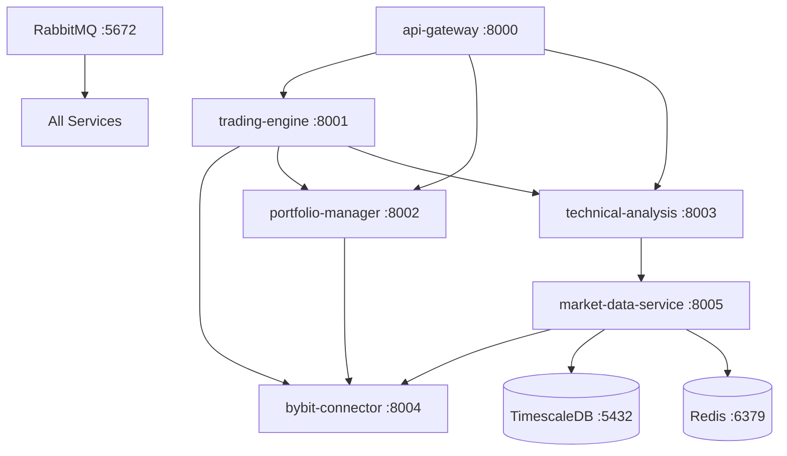

# CLAUDE.md - Crypto Trading Bot Project Control System
# Version: 4.0 - God Class Destroyer Mission Complete
# Last Updated: 2025-11-19
# Status: ✅ REFACTORING COMPLETE - PRODUCTION READY

---

## 🏆 **GOD CLASS DESTROYER - MISSION ACCOMPLISHED**

**Date Completed:** November 18-19, 2025
**Pattern Used:** Strangler Fig (Incremental Migration)
**Status:** ✅ **ALL 5 GOD CLASSES DESTROYED**

### Refactoring Results:

| Service | Before | After | Reduction | Modules Created | Status |
|---------|--------|-------|-----------|-----------------|--------|
| signal-aggregator | 651 lines | 489 lines | -25% | 3 modules | ✅ COMPLETE |
| technical-analysis | 987 lines | 427 lines | -56% | 9 modules | ✅ COMPLETE |
| trading-engine | 606 lines | 328 lines | -46% | 8 modules | ✅ COMPLETE |
| portfolio-manager | 1,046 lines | 291 lines | -72% | 10 modules | ✅ COMPLETE |
| market-data-service | 868 lines | 332 lines | -62% | 9 modules | ✅ COMPLETE |

**Total Achievement:**
- God Classes Destroyed: 5/5 (100%)
- Average Size Reduction: 52%
- Total Modules Created: 39 focused modules
- Architecture: Clean 4-layer (HTTP → Utils → Services → Domain)
- Breaking Changes: 0 (100% backward compatible)

### Documentation:
Each service has a `REFACTORING_COMPLETE.md` file with detailed metrics and architecture diagrams.

---

# CLAUDE.md - Original Project Control System
# Version: 3.0 - Context-Aware with Agent Orchestration
# Created: 2025-11-18
# Note: Below is the original development guide. Refactoring phase is now complete.

## 🚨 CRITICAL: CONTEXT RECOVERY PROTOCOL
**BEFORE ANY ACTION, EXECUTE IN ORDER:**
1. Run `find . -type f -name "*.py" | head -20` to see project structure
2. Check `git status` and `git log --oneline -10` for recent changes
3. Read `progress.md` to understand current state
4. Scan `.claude/agents/` directory for available agents
5. Review last 5 files in `services/` directory

## 🤖 AGENT ORCHESTRATION SYSTEM

### Available Agents Location
```
.claude/agents/
├── architect.md        # System design decisions
├── developer.md        # Code implementation
├── tester.md          # Testing strategy
├── documenter.md      # Documentation updates
├── reviewer.md        # Code review
├── debugger.md        # Error resolution
└── devops.md          # Deployment & monitoring
```

### MANDATORY: Agent Activation Protocol
```python
# At start of EVERY session, Claude must:
# 1. List all agents: ls -la .claude/agents/
# 2. Read relevant agent for current task
# 3. State which agent role is being used
# 4. Follow that agent's specific instructions

# Example:
print("Activating Developer Agent from .claude/agents/developer.md")
# Then execute according to agent instructions
```

## 📍 PROJECT STATE TRACKER

### Current Working Directory Check
```bash
# ALWAYS run before any operation:
pwd && ls -la
tree -L 2 services/  # See service structure
grep -r "TODO" --include="*.py" services/  # Find pending tasks
```

### Session State Recovery Commands
```bash
# Run this command block at session start:
cat << 'EOF' > check_state.sh
#!/bin/bash
echo "=== PROJECT STATE CHECK ==="
echo "Current branch: $(git branch --show-current)"
echo "Modified files: $(git status -s | wc -l)"
echo "Services running: $(docker ps --format 'table {{.Names}}\t{{.Status}}' 2>/dev/null)"
echo "Test coverage: $(pytest --cov=services --cov-report=term | grep TOTAL 2>/dev/null)"
echo "Last commit: $(git log -1 --oneline)"
echo "=== COMPLETED SERVICES ==="
find services/ -name "main.py" -exec dirname {} \; | sort
echo "=== TODO ITEMS ==="
grep -r "TODO\|FIXME" --include="*.py" services/ | head -5
EOF
bash check_state.sh
```

## 📊 COMPLETION TRACKING SYSTEM

### Service Implementation Status
```yaml
# UPDATE THIS SECTION AFTER EACH CHANGE
services:
  bybit-connector:
    status: [IN_PROGRESS/COMPLETED/NOT_STARTED]
    files_created: []
    tests_written: []
    last_modified: ""
    
  market-data-service:
    status: [IN_PROGRESS/COMPLETED/NOT_STARTED]
    files_created: []
    tests_written: []
    last_modified: ""
    
  technical-analysis:
    status: [IN_PROGRESS/COMPLETED/NOT_STARTED]
    files_created: []
    tests_written: []
    last_modified: ""
    
  portfolio-manager:
    status: [IN_PROGRESS/COMPLETED/NOT_STARTED]
    files_created: []
    tests_written: []
    last_modified: ""
    
  trading-engine:
    status: [IN_PROGRESS/COMPLETED/NOT_STARTED]
    files_created: []
    tests_written: []
    last_modified: ""
    
  api-gateway:
    status: [IN_PROGRESS/COMPLETED/NOT_STARTED]
    files_created: []
    tests_written: []
    last_modified: ""
```

## 🔄 CONTINUOUS CONTEXT MAINTENANCE

### File Reading Protocol
```python
# NEVER assume file content - ALWAYS read first
def work_on_file(filepath):
    """Standard protocol for file operations"""
    # Step 1: Check if file exists
    if not os.path.exists(filepath):
        print(f"Creating new file: {filepath}")
        return create_new_file(filepath)
    
    # Step 2: Read ENTIRE file
    with open(filepath, 'r') as f:
        current_content = f.read()
    print(f"Read {len(current_content)} chars from {filepath}")
    
    # Step 3: Show last modification
    mtime = os.path.getmtime(filepath)
    print(f"Last modified: {datetime.fromtimestamp(mtime)}")
    
    # Step 4: Make changes with full context
    return modify_with_context(filepath, current_content)
```

### Memory Persistence Commands
```bash
# Save current state before major changes
echo "$(date): $(git status -s)" >> .claude/session_history.log
git diff > .claude/current_changes.diff

# Create breadcrumbs for context
echo "Working on: $CURRENT_TASK" > .claude/current_task.txt
echo "Using agent: $ACTIVE_AGENT" > .claude/active_agent.txt
```

## 🏗️ MICROSERVICES CONTEXT MAP

### Service Dependencies & Communication


### Inter-Service Contract Verification
```python
# Run this to verify service contracts
def verify_service_contracts():
    """Check all services implement required interfaces"""
    contracts = {
        'bybit-connector': ['place_order', 'get_balance', 'get_positions'],
        'market-data-service': ['get_candles', 'subscribe_ticker', 'get_orderbook'],
        'technical-analysis': ['calculate_rsi', 'calculate_macd', 'get_signals'],
        'portfolio-manager': ['update_position', 'calculate_pnl', 'get_equity'],
        'trading-engine': ['execute_strategy', 'manage_risk', 'process_signal'],
    }
    
    for service, methods in contracts.items():
        service_file = f"services/{service}/main.py"
        if os.path.exists(service_file):
            with open(service_file, 'r') as f:
                content = f.read()
                for method in methods:
                    if method not in content:
                        print(f"❌ {service} missing: {method}")
                    else:
                        print(f"✅ {service} has: {method}")
```

## 📝 DOCUMENTATION AUTO-UPDATE TRIGGERS

### Document Update Matrix
```python
# When you modify these files → Update these docs
update_matrix = {
    'services/*/main.py': ['docs/api/openapi.yaml', 'docs/architecture/SYSTEM_OVERVIEW.md'],
    'services/*/models.py': ['docs/api/schemas.md', 'docs/architecture/DATA_MODELS.md'],
    'tests/test_*.py': ['docs/development/TESTING.md', 'coverage.md'],
    'docker-compose.yml': ['docs/architecture/DEPLOYMENT.md', 'README.md'],
    'requirements.txt': ['docs/development/SETUP.md', 'docs/dependencies.md'],
}

# Auto-update command
def update_docs_for_file(changed_file):
    for pattern, docs in update_matrix.items():
        if fnmatch(changed_file, pattern):
            for doc in docs:
                print(f"UPDATE REQUIRED: {doc}")
                update_documentation(doc, changed_file)
```

## 🛠️ ERROR RECOVERY PROCEDURES

### When Claude Gets Confused
```bash
# Reset and recovery sequence
reset_context() {
    # 1. Save current work
    git stash
    
    # 2. Show me where we are
    pwd
    ls -la
    
    # 3. Check service status
    docker-compose ps
    
    # 4. Show recent changes
    git diff HEAD~5..HEAD --stat
    
    # 5. Read main entry points
    for service in services/*/main.py; do
        echo "=== $service ==="
        head -50 "$service"
    done
    
    # 6. Restore work
    git stash pop
}
```

### Code Completion Protocol
```python
# NEVER use placeholders - ALWAYS write complete code
# Bad:
def process_data(data):
    # ... rest of implementation

# Good:
def process_data(data):
    """Process market data with full implementation"""
    # Validate input data
    if not isinstance(data, dict):
        raise ValueError(f"Expected dict, got {type(data)}")
    
    # Process each data point
    results = []
    for key, value in data.items():
        # Actual processing logic
        processed = {
            'timestamp': datetime.now(),
            'key': key,
            'value': value * 1.1,  # Example calculation
            'status': 'processed'
        }
        results.append(processed)
    
    # Return complete results
    return results
```

## 📋 TASK COMPLETION CHECKLIST

### For Each Service Implementation
```markdown
- [ ] Agent activated and instructions read
- [ ] Service directory created
- [ ] __init__.py with version
- [ ] models.py with Pydantic models
- [ ] config.py with settings
- [ ] main.py with FastAPI app
- [ ] handlers/ directory with route handlers
- [ ] services/ directory with business logic
- [ ] tests/test_[service].py with >80% coverage
- [ ] Dockerfile created
- [ ] requirements.txt updated
- [ ] Service added to docker-compose.yml
- [ ] API documented in openapi.yaml
- [ ] README.md in service directory
- [ ] Integration test written
- [ ] Service registered in api-gateway
- [ ] Monitoring endpoints added
- [ ] Logging configured
- [ ] Error handling implemented
- [ ] Rate limiting added
- [ ] Health check endpoint
- [ ] Metrics endpoint
- [ ] Service added to progress.md
```

## 🔍 PROGRESS VERIFICATION COMMANDS

### Daily Progress Check
```bash
# Run at end of each session
create_progress_report() {
    echo "=== Daily Progress Report $(date) ===" > daily_report.md
    
    # Files changed today
    echo "## Files Modified Today" >> daily_report.md
    git diff --stat $(date -d 'yesterday' '+%Y-%m-%d')..HEAD >> daily_report.md
    
    # Tests status
    echo "## Test Coverage" >> daily_report.md
    pytest --cov=services --cov-report=term >> daily_report.md
    
    # Services status
    echo "## Service Health" >> daily_report.md
    for port in 8000 8001 8002 8003 8004 8005; do
        curl -s http://localhost:$port/health && echo "✅ Port $port" || echo "❌ Port $port"
    done >> daily_report.md
    
    # TODOs remaining
    echo "## Remaining TODOs" >> daily_report.md
    grep -r "TODO" --include="*.py" services/ | wc -l >> daily_report.md
    
    cat daily_report.md
}
```

## 🎯 IMMEDIATE NEXT ACTIONS

### Priority Task Queue
```python
# Check and execute in order
priority_tasks = [
    {
        'task': 'Complete bybit-connector WebSocket handler',
        'files': ['services/bybit-connector/websocket_handler.py'],
        'agent': 'developer.md',
        'tests': ['tests/test_websocket.py']
    },
    {
        'task': 'Implement market-data-service storage',
        'files': ['services/market-data-service/storage.py'],
        'agent': 'developer.md',
        'tests': ['tests/test_storage.py']
    },
    {
        'task': 'Create technical-analysis indicators',
        'files': ['services/technical-analysis/indicators.py'],
        'agent': 'developer.md',
        'tests': ['tests/test_indicators.py']
    }
]

# Execute next task
def execute_next_task():
    for task in priority_tasks:
        if not all(os.path.exists(f) for f in task['files']):
            print(f"Starting: {task['task']}")
            print(f"Using agent: {task['agent']}")
            return task
    print("All priority tasks completed!")
```

## 🚀 STARTUP SEQUENCE FOR EVERY SESSION

```bash
#!/bin/bash
# Save as: start_session.sh

echo "=== CLAUDE CODE SESSION INITIALIZATION ==="

# 1. Verify project root
if [ ! -f "CLAUDE.md" ]; then
    echo "ERROR: Not in project root!"
    exit 1
fi

# 2. Load agents
echo "Loading agents..."
ls -la .claude/agents/

# 3. Check git status
echo "Repository status..."
git status -s

# 4. Verify services
echo "Checking services..."
find services -name "main.py" | while read service; do
    echo "Found: $service"
done

# 5. Read last progress
echo "Last progress entry..."
tail -20 progress.md

# 6. Set working context
echo "Ready for development!"
echo "Current focus: $(cat .claude/current_task.txt 2>/dev/null || echo 'Not set')"
```

## ⚠️ CRITICAL REMINDERS

1. **ALWAYS READ FILES BEFORE MODIFYING** - Never assume content
2. **USE AGENTS FOR EVERY TASK** - Check `.claude/agents/` first
3. **UPDATE progress.md AFTER EACH CHANGE** - No exceptions
4. **WRITE COMPLETE CODE** - No placeholders, no "rest remains"
5. **TEST BEFORE COMMIT** - Run tests for modified services
6. **DOCUMENT API CHANGES** - Update openapi.yaml immediately
7. **CHECK SERVICE DEPENDENCIES** - Verify inter-service communication
8. **USE FULL PATHS** - Always use absolute paths in commands
9. **PRESERVE EXISTING WORK** - Read git history before changes
10. **MAINTAIN CONTEXT** - Save state between operations

## 🔧 TROUBLESHOOTING GUIDE

### If Claude forgets context:
```bash
# Quick context recovery
cat CLAUDE.md | head -100  # Read instructions
ls -la services/  # See what exists
git log --oneline -20  # See what was done
docker ps  # Check running services
```

### If tests fail:
```bash
# Debug test failures
pytest -xvs tests/test_failed.py::specific_test
docker logs [service-name]
tail -f logs/[service].log
```

### If services won't start:
```bash
# Service startup debug
docker-compose logs [service-name]
docker-compose exec [service-name] /bin/bash
netstat -tulpn | grep [port]
```
```

Теперь создам файл для агентов-примеров:

```markdown
# .claude/agents/developer.md
## Developer Agent Instructions

I am the Developer Agent responsible for code implementation.

### My Responsibilities:
1. Write complete, production-ready code
2. Follow TDD - tests first, implementation second
3. Add comprehensive comments
4. Never use placeholders
5. Implement full error handling

### Before Starting Any Task:
```bash
# Check existing code
find . -name "*.py" -path "*/services/*" -exec grep -l "class\|def" {} \;
# Read related tests
ls -la tests/
# Check dependencies
cat requirements.txt
```

### Code Standards:
- Type hints for all functions
- Docstrings for all classes/methods
- Comments explaining complex logic
- Error handling with proper logging
- No hardcoded values - use config

### Implementation Template:
```python
#!/home/user/crypto-bot/venv/bin/python
"""
Module: [name]
Purpose: [description]
Author: Developer Agent
Date: [current date]
"""

import logging
from typing import Optional, Dict, Any
from datetime import datetime

# Configure logging
logger = logging.getLogger(__name__)

class ServiceName:
    """
    Main service class
    
    Attributes:
        config: Service configuration
        connection: Database/API connection
    """
    
    def __init__(self, config: Dict[str, Any]) -> None:
        """Initialize service with configuration"""
        self.config = config
        self.connection = None
        logger.info(f"Initialized {self.__class__.__name__}")
    
    async def method_name(self, param: str) -> Optional[Dict]:
        """
        Method description
        
        Args:
            param: Parameter description
            
        Returns:
            Optional[Dict]: Return value description
            
        Raises:
            ValueError: When param is invalid
        """
        try:
            # Implementation with detailed comments
            logger.debug(f"Processing {param}")
            
            # Actual logic here
            result = {"status": "success", "data": param}
            
            logger.info(f"Successfully processed {param}")
            return result
            
        except Exception as e:
            logger.error(f"Error processing {param}: {e}", exc_info=True)
            raise
```

### Completion Checklist:
- [ ] Tests written first
- [ ] Full implementation (no placeholders)
- [ ] All functions have type hints
- [ ] All classes/methods have docstrings
- [ ] Error handling implemented
- [ ] Logging added
- [ ] Configuration extracted
- [ ] No hardcoded values
- [ ] Code passes linting
- [ ] Tests pass with >80% coverage
```

